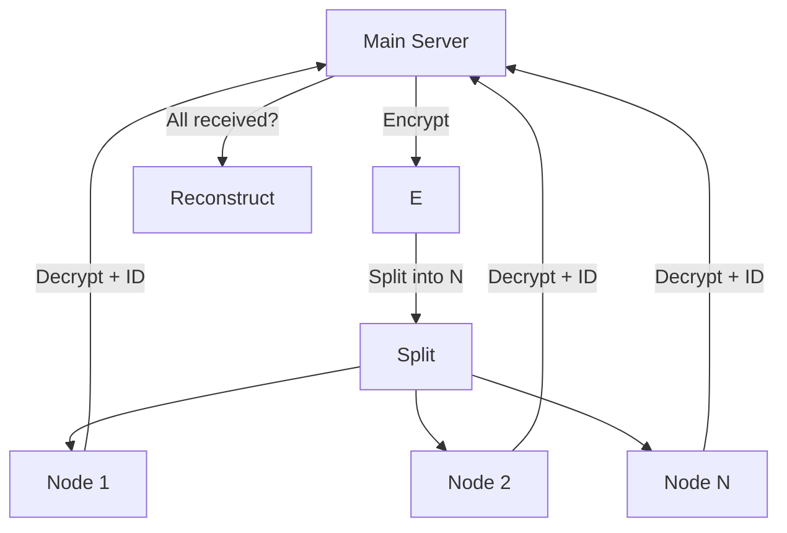

# Decentralized Processing System (DPS)  
**Distributed Encrypted String Decryption via Worker Nodes**

  

---

## Abstract

The system encrypts a string with a custom pattern, splits it into two parts, sends each part to a remote worker node for decryption, and reconstructs the original message upon receiving both responses.

This project demonstrates key concepts in:
- Distributed systems
- Network programming
- Parallel processing
- Secure data handling

> **Warning**: This is **not production-ready**. It uses a custom encryption scheme and lacks security hardening.

---

## System Architecture

### Components

| Component           | Role |
|---------------------|------|
| **Main Server**     | Encrypts, splits, distributes, collects, and reconstructs |
| **Worker Nodes (×2)** | Receive encrypted part, decrypt, return plaintext |
| **TCP Sockets**     | Communication channel between server and nodes |
| **Result Array**    | Ordered collection buffer for reassembly |

## Design Strengths

1. **Parallel Execution**  
   Decryption runs concurrently on two nodes.

2. **Ordered Reassembly**  
   Indexed array ensures correct reconstruction regardless of response order.

3. **Simple & Portable**  
   Uses standard TCP sockets — works across platforms.

4. **Extensible Core**  
   Foundation for scaling to *N* nodes and advanced patterns.

---

## Critical Limitations

| Category       | Issue |
|----------------|-------|
| **Scalability** | Hardcoded to **2 nodes**; array size mismatch with part count |
| **Security**    | Custom encryption, no TLS, partial plaintext exposure |
| **Reliability** | No timeouts, retries, or error handling |
| **Efficiency**  | Network overhead > benefit for small messages |

## Proposed Enhanced Architecture

---

## Author & Analysis

- **Developer**: [shimodii](https://github.com/shimodii)
  *October 24, 2025*
